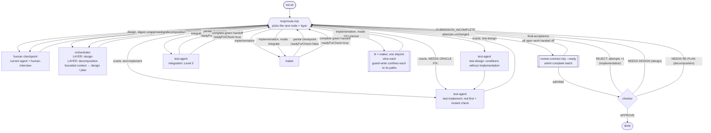

# The harness as an explicit graph

`workflow-diagram.md` draws what the harness is *meant* to do. This file states what it *actually
executes*: every node, every edge, who owns every field of shared state, and the routing rule that
picks the next node. The difference between the two documents is the point — writing this one is
what surfaced seven edges that existed only inside an agent's context.

Scope: the project loop (`node loop/run-loop.mjs`). The harness self-improvement loop
(`scripts/harness-loop.sh`) is a second graph; the one edge between them is listed at the end.

## Nodes

All paths in this graph are relative to the harness root — the project root itself on a flat
layout (the default), or the `harness/` subdirectory on a contained one — unless they begin with a
root runtime adapter such as `.kiro/`. `cli.mjs` is the stable project-root interface (`node
harness/cli.mjs` when contained). A contained layout's thin root `AGENTS.md` only points agents at
`harness/AGENTS.md`; a flat layout's `AGENTS.md` is the real one (HI-054).

| Node | Kind | Responsibility | Reads | Writes |
|---|---|---|---|---|
| `init.mjs` | code | baseline gate — build + test + constraint gates. `init.sh`/`init.cmd` are wrappers so the same gate runs on POSIX shells and cmd.exe | repo | exit code |
| `cli.mjs` | code | one stable interface for status, baseline, coverage, verification, routing and loop execution | command + contained home | delegated command result |
| `tools/harness-status.mjs` | code | compare an uncommitted harness with its installation receipt; report modified, missing and unmanaged paths without Git history | `installation.json`, current harness tree | status report only |
| `tools/environment.mjs` | code | capture machine-local Java/Maven paths, kubeconfig/context and API-key presence without persisting secret values | process environment, PATH, kubectl context | ignored `env/local.json` |
| `tools/collect-services.mjs` | code | integration targets only — survey N repos into the registry; fills what is discoverable, marks the rest `needs-human`; service rules carry scope + digest + provenance | the service repos | `services.manifest.json` |
| `skills/harness-upgrade` | capability | onboarding-only three-way upgrade: classify ownership, plan drift/retirement merges, preserve target customization, regenerate and verify | canonical harness, target rules/status, upgrade dry-run | reviewed upgrade plan + upgraded target |
| `tools/context-plan.mjs` | code | select scoped external rules and validate the active feature's digest-bound context packet | `services.manifest.json`, `feature_list.json`, `loop/current.json`, original rule files, `loop/context-packets/**` | typed `context-plan/1` with packet freshness |
| `verify-harness.mjs` context-supply gate | code | reject a service-rule registry with no working selector/loader path | registry plus scaffolded context tools | `service-rules-unread`, layer harness |
| `tools/services-check.mjs` | code | integration targets only — the registry's own verification: exits non-zero while a deployable service lacks chart/image/health/`dependsOn` | `services.manifest.json` | exit code |
| user-scope `human-interview` | capability | let the agent that found a human-owned gap ask in the same context after exhausting discoverable evidence; persist a typed answer receipt | current task context, scoped evidence, unresolved decision | canonical assumption/decision/context artifact or allowed handoff receipt |
| `orchestrator` | agent | human-facing front door and the consolidated design/planning phase: bounded context gathering, components, cited claims, assumption registry, observable seams/invariants, critique, and the build/prove DAG. **Never writes `status: approved` or `status: done`** — human approval and checker acceptance remain separate | requirement, docs, focused context packet | `docs/design/**`, `feature_list.json`, context packets, design/plan state |
| `test-agent` | agent | one oracle owner with phase isolation: `test-design` specifies conditions without implementation access; `test-implement` writes red-first, mutant-checked tests; `integration` proves Level 3 through the deployed boundary | spec, interfaces, conditions; integration also reads service evidence | `tests/design/**`, test sources, integration evidence |
| `harness-manager` | agent | setup and canonical-harness repair: establishes a real baseline, then fixes verifier-reported harness defects in source rather than one target | toolchain, verifier evidence, canonical harness | `templates/tree/**`, `scripts/**`, upgrade receipts |
| `maker` | agent | advance exactly one feature by one step; publish a digest-bound `reviewPacket` only for a complete claim. Runs in one of three modes — **lead** (may cut the step into parallel slices), **slice worker** (`$HARNESS_SLICE` set: one disjoint file set, no questions, no state writes), **integrator** (`mode: integrate`: runs the feature verification once and owns the claim) | `feature_list.digest.md`, docs, its slice brief | source, `feature_list.json`, `progress.md`; a slice worker writes only its own paths |
| `tools/work-split.mjs` | code | admit or refuse a parallel maker iteration: slices pairwise disjoint by glob **and** by working tree, no slice reaching single-writer state, every brief self-contained, fan-in running the feature's own verification. Also generates the worker brief and records slice transitions | `loop/work-split/<feat>.json`, feature contract digest, the working tree | `loop/work-split/<feat>.json` validation receipt + slice status, `loop/work-split-log.jsonl` |
| `tools/review-contract.mjs` | code | validate each maker handoff before the final acceptance batch; classify missing data as `SUBMISSION_INCOMPLETE`, never REJECT | stable feature contract + `reviewPacket` | exit code + JSON admission report |
| `tools/agent-context.mjs` | code | injects role resources, scoped service rules, and only fresh feature packets plus their `mustRead` originals | `agents.manifest.json`, listed files, `context-plan/1` | context, `harnessContextInputs`, typed `harnessContextReceipt` |
| `tools/telemetry.mjs` | code | normalize runtime hooks into redacted direct-read/search vs shell-inference events; never retain hook responses | Claude/Kiro PostToolUse, Codex shell hooks | `trace/tool-events.jsonl` (`tool-event/1`) |
| `tools/telemetry-calibrate.mjs` | code | fixture-check each adapter and publish its honest runtime coverage ceiling | generated telemetry tools | `trace/telemetry-capabilities.json` |
| `tools/hook-calibrate.mjs` | code | exercise runtime-specific PreToolUse allow/deny output with the installed runtime version; fail dispatch when either branch is malformed | `guard-write.mjs`, installed runtime | `trace/hook-capabilities.json` |
| `tools/run-report.mjs` | code | aggregate sessions, read/search duplication with coverage labels, state, verification, memory and human-attention signals | trace streams, feature state, verify snapshot, git, memory | human/JSON report |
| `tools/guard-write.mjs` | code | classify an edit against an agent's `writes` — or, when `$HARNESS_SLICE` is set, against that slice's paths alone — then adapt output per runtime: Claude emits allow/deny; Codex emits neutral/deny | `agents.manifest.json`, `loop/work-split/<feat>.json`, runtime, tool payload | runtime-specific PreToolUse response |
| `tools/codex-dispatch.mjs` | code | Codex only — assembles a role (`codex exec` has no `--agent`): prompt + resources on stdin, identity in the environment | `agents.manifest.json`, prompts, `agent-context.mjs` | nothing (spawns codex) |
| `loop/route.mjs` | code | **the router** — reads shared state, returns the next node + its layer + why (+ the marker hash, when a marker drove it). Splits a repair in two: a `mode: diagnose` turn that proves the cause, then the implement turn. `--rules` prints the whole table, so nothing has to parse its source | `feature_list.json`, `docs/assumptions.md`, `loop/route-log.jsonl` | nothing (pure) |
| `loop/dispatch.mjs` | code | fallback adapter that runs ONE named agent when native in-session sub-agent spawn is unavailable, or from automation/CI. Kiro uses `tools/kiro-acp-dispatch.mjs` and ACP; Claude/Codex use their CLI adapters. `--check` is the pre-step gate: prove the runtime is driveable before a turn is spent. `classify()` + a jittered exponential backoff retry a dispatch that returned **nothing** (`TRANSPORT`, `EMPTY_RESPONSE`); anything that produced output is terminal, because that turn may have landed work. Called by `run-loop.mjs`; does **not** choose who runs | `agents.manifest.json`, `HARNESS_RUNTIME` | nothing directly; the agent it spawns writes |
| `loop/baseline-cache.mjs` | code | **opt-in** cross-session baseline cache: digests the working tree the gate builds plus declared toolchain probes, and lets `run-loop.mjs` reuse a recorded **green** when nothing that feeds the gate changed. Every rule fails toward running — no policy file, no git, no recorded digest, a red baseline or a stale one all mean run. Run it alone to see the decision (exit 0 reuse, 1 run). Policy and the fail-toward-running table: [baseline-cache.md](baseline-cache.md) | `loop/baseline-cache.json`, the git work tree, `loop/baseline-state.json` | nothing (pure) |
| `loop/run-loop.mjs` | code | **the dispatcher** — runs the node the router named on Windows, macOS or Linux, using kiro-cli, Claude Code or Codex (`HARNESS_RUNTIME`, else detected). Runs the baseline gate once per session (re-running only while red to confirm a repair), and across sessions may reuse a green one via `baseline-cache.mjs`; then replays features once at the end. It early-exits only for `done`, blocked-with-reason, or `passing` **without** `readyForCheck`; a ready handoff still reaches final acceptance. `.sh`/`.cmd` are wrappers | `route.mjs` output | nothing directly; the agent it spawns writes |
| `loop/approval-gate.mjs` | code | **manual** human judgement before a terminal `done` claim; selective, timeout auto-**rejects**. No longer auto-invoked by `run-loop.mjs` — the checker owns final acceptance — but a human may run it by hand to hold a claim | `feature_list.json`, `review-digest` output | `loop/approval-request.md`, `loop/approval-log.jsonl` |
| `tools/trace-insights.mjs` | code | the **dynamic** counterpart to the static gates: replays what the loop did and what it made a person do — checker rejections, router escalations to `human`, rejected and unanswered approvals, marker churn, unverified assumptions — and emits signed options. `--report` writes the `trace-insights/1` artifact the skill backlog imports. Read-only | `trace/*.jsonl`, `loop/route-log.jsonl`, `loop/approval-log.jsonl`, `docs/assumptions.md`, `feature_list.json` | `trace/insights-report.json` only |
| `tools/feature.mjs` | code | one feature out of `feature_list.json` in full, without loading the file. The pair to the digest: digest = every feature in one line, this = one feature in full | `feature_list.json` | nothing |
| `tools/timeline.mjs` | code | **how it got here** — replays git history of `feature_list.json` into per-day transitions, net weekly progress, reopens, and per-feature age. Read-only | git history, `feature_list.json` | nothing |
| `tools/loop-status.mjs` | code | **the live view** — where the loop is *right now*: done/total/percent/remaining progress, in-flight node + elapsed, escalations, dispatch trail, livelock warning. Read-only, safe against a running loop | `loop/current.json`, `route.mjs`, `feature_list.json`, `route-log.jsonl`, git | nothing |
| `tools/trajectory.mjs` | code | **the trajectory** — the loop's recorded run as one time-ordered ledger: marker routes, decision-path events and redacted tool activity with timing, plus `--record`/`--summary`/`--json`. Read-only, safe against a running loop | `trace/trace.jsonl`, `trace/tool-events.jsonl`, `loop/route-log.jsonl` | nothing |
| `tools/trace-insights.mjs` | code | **optimization options from the trace** — mines the recorded run for recurring inefficiency (rejects, blind telemetry, dispatch friction, rediscovery, marker churn) and emits ranked options, each with a layer (harness/workflow/skill), evidence and a remedy. Read-only | `trace/trace.jsonl`, `trace/tool-events.jsonl`, `loop/route-log.jsonl`, `feature_list.json` | nothing |
| `tools/harness-config.mjs` | code | get/set the machine-local runtime config (`env/local.json`) — today the `runMode` knob (`native-spawn` \| `script-dispatch`), merging around `environment.mjs`'s captured fields so the two never clobber each other | `env/local.json` | `env/local.json` |
| the human, between iterations | human | attended mode: `run-loop.mjs` pauses after every iteration and waits. This is the **default**; `--headless` is what you graduate to | the diff, `loop-status.mjs` | continue / stop |
| `verify-harness` | code | replay claimed evidence without replacing semantic acceptance | `feature_list.json`, repo | `trace/verify-report.json` |
| `checker` | agent | final acceptance after every non-blocked open feature is handed off; `passing` remains open while `readyForCheck=true`; falsify the integrated delivery; sole workflow owner of `done` | all handoffs, `feature_list.json`, evidence | `feature_list.json`, `progress.md` (state files only) |
| `skills/business-journey` | capability | Level 4 public command-to-outcome journeys: isolation, business readiness, distributed oracle, fault/idempotency proof and redacted metrics | requirement, service registry, environment/oracles | executable scenario artifacts and deterministic check |
| `skills/quality-strategy` | capability | living Capability–Attribute risk and orthogonal scope/size classification; rejects uncovered material risk and unsafe large-test scheduling | requirements, components, human risk decisions, oracle artifacts | `test-risk.json` and deterministic findings |
| user-scope `human-presenter` | capability | lightweight pre-delivery audit for every substantive human-facing message; routes intent, provenance, uncertainty, language and the smallest useful representation without becoming a workflow node | the current agent's established claims and reader task | clearer user-facing answer; no project state |

`human-interview` is not a dispatchable node. The originating agent invokes it before yielding; an old
`needs-human` row reaching the router returns a human checkpoint that the current conversation
resolves, preserving the context that made the gap legible.

The completed-feature retrospective is likewise not a router node: the orchestrator runs it only
after observing a new `done` transition. Its one proposal is recorded with evidence and an approval
or rejection in `session-handoff.md`; approval begins a bounded orchestrator planning phase for a
project change, or the harness-manager improvement pipeline for a canonical change. The
orchestrator cannot turn a telemetry signal into a source edit by itself.

`maker`, `test-agent` and `harness-manager` write within the responsibility declared in the
manifest; the checker and orchestrator are confined by their `writes` lists — enforced on kiro by
`toolsSettings.write.allowedPaths` and on Claude Code by the `guard-write.mjs` hook
(`runtimes.md`). **That confinement is the edge set**: an agent cannot create a handoff it has no
write access to.
**The orchestrator has two mechanically separated responsibilities.** It is the human front door,
but `route.mjs` may also name it for design or planning. In that latter case it first gathers only a
bounded context packet, performs the named phase, and returns to the router; it never chooses a
different node or implements product code/tests.

`human-presenter` is likewise absent from routing because it is not an agent or a state transition. It
wraps substantive communication in the current context; routing it as a node would recreate the
context switch the user-scope skill exists to remove. For Kiro, `install-user-skill.mjs` writes a
global `inclusion: always` steering bridge pointing at the installed skill — loaded with agent
context, exposing activation rules, not the whole skill. `human-interview` uses the same bridge but
stays conditional on a human-owned information gap.

Every agent node above is generated from `agents.manifest.json` into all three runtimes: adding one
means a manifest entry, not three config files.

**The edge set is only as real as the runtime makes it.** On kiro and Claude Code the `writes` list is
enforced per agent. On Codex it holds only when `tools/codex-dispatch.mjs` runs the role — Codex hooks
are project-wide and its agent TOML has no hooks field, so an interactively-spawned Codex agent has no
enforced confinement and `guard-write.mjs` says so rather than implying a check ran (`runtimes.md`).
Same graph, weaker edges on one runtime.

Kubernetes work is a `test-agent` **integration** phase, not an optional sixth agent. A chart or a
`tests/k8s/` journey makes the router select that phase; `tools/k8s-test-env.sh` remains the only
deploy/teardown path.

## Shared state — one owner per field

| Field | Writer | Readers | Merge rule |
|---|---|---|---|
| `feature_list.json[].status` | `checker` in the project workflow | all | final acceptance writes `done`; rejected claims return to `in-progress` or `blocked` |
| `feature_list.json[].readyForCheck` | `maker` | `route.mjs`, `run-loop.mjs`, `checker` | complete handoff unlocks dependencies; it keeps a `passing` feature open until checker clears the handoff, then checker runs when all remaining open features are handed off |
| `feature_list.json[].evidence` | `maker` | `checker`, verifier | overwrite per attempt |
| `feature_list.json[].reviewPacket` | `maker` | `review-contract.mjs`, `checker` | overwrite per submission; `contractDigest` binds behavior, verification, falsifier, dependencies and context |
| `feature_list.json[].checkerVerdict` | `checker` | maker, verifier, router/human reports | overwrite per semantic review; REJECT carries a reproducible counterexample + exit criterion |
| `feature_list.json[].checkerNotes` | `checker`, `maker`, `test-agent` (clears `NEEDS ORACLE FIX:` only) | `maker`, `orchestrator`, `test-agent` | append; **first line is the routing marker**. The node that answers a marker must be able to clear it |
| `feature_list.json[].attempts` | `checker` | maker, gate `over-budget` | +1 per rejected review cycle, never per maker checkpoint, never reset |
| `feature_list.json[].falsifier` | `orchestrator`, `test-agent` | `checker` | overwrite |
| `docs/assumptions.md` | `orchestrator`, `test-agent`; human answer captured in place with `human-interview` | all | row-level; status only moves toward `verified` |
| `docs/cross-cutting.md` | `orchestrator`; human choice captured in place with `human-interview` | all | a row closes only with mechanism + owner + enforcing rule |
| `progress.md` / `session-handoff.md` | `maker`, `checker` | next session | append |
| `trace/**`, `memory/<agent>/**` | each agent, its own dir only | that agent at spawn; `trajectory.mjs` and `run-report.mjs` read `trace/**` | append |
| `loop/approval.md` | **the human** | `approval-gate.mjs` | first line is the verdict; a verdict with no reason is treated as a rejection |
| `loop/approval-log.jsonl` | `approval-gate.mjs` | audit | append-only |
| `loop/work-split/<feat>.json` | the lead `maker` writes the plan; `work-split.mjs` writes its `validation` receipt | `route.mjs`, `guard-write.mjs`, the workers | one writer, one turn. Bound to the feature's contract digest, so a changed behavior, verification, falsifier or dependency invalidates the split instead of silently re-cutting it |
| `loop/work-split/<feat>.<slice>.json` | that slice's own worker, through `work-split.mjs` | `route.mjs`, `loop-status.mjs` | **no merge rule needed** — one file per slice removes the read-modify-write several workers would otherwise race on. A shared `status` field in the plan would lose whichever completion landed second and re-dispatch a slice already built |
| `loop/current.json` | `run-loop.mjs` (the dispatcher) | `loop-status.mjs` | written at dispatch, stamped `finishedAt` on return. A stale entry with no live process means that iteration crashed or was killed |
| `loop/route-log.jsonl` | `run-loop.mjs` (the dispatcher) | `route.mjs`, `loop-status.mjs`, `trajectory.mjs` | append-only. Every dispatch — node, layer, `mode`, and the marker (`hash`/`requestId`) when one drove it. The `mode` matters for bounded turns: a `diagnose` row must not spend the one repair turn it exists to inform. The router reads it to tell "this node has not had a turn on this marker" from "it had one and nothing changed"; loop-status reads only marker rows for the livelock warning, because an ordinary maker checkpoint on one active feature is the normal shape, not a livelock — the router stays pure, the dispatcher records |
| `loop/baseline-state.json` | `run-loop.mjs` | `route.mjs`, `baseline-cache.mjs` | typed `green|red` outcome plus evidence digest; red is routable state, not an out-of-graph shell exit. A cached session adds `inputsDigest` (what the verdict belongs to), `reusedAt` and `reuseCount` — `checkedAt` keeps saying when the gate actually ran, so a reuse is recorded rather than disguised as a run |
| `loop/baseline-cache.json` | **the human** (the project declares its own policy) | `baseline-cache.mjs` | opt-in; absent means the cache is off. Holds `maxAgeHours`, the digest `root`, toolchain `probes` and extra `ignore` paths. Loop bookkeeping the driver rewrites every run is ignored unconditionally, or the digest would miss every time |
| `loop/diagnosis/<key>.json` | the `maker` on a `mode: diagnose` turn | `route.mjs` | one file per FAILURE identity — `baseline:<evidenceDigest>` or `<feat-id>#<attempts>` — so a new digest or one more rejection needs its own. Valid only with a non-empty `symptom`, `cause`, `provedBy.cmd` and at least one `ruledOut` entry: an explanation nothing could have contradicted has not been tested. Shape: `loop/diagnosis/README.md` |
| `loop/design-approval.json` | **the human** (in an orchestrator design phase; it may never write `status: approved` itself) | `route.mjs`, orchestrator, test-agent, maker, checker | approval is bound to the current design digest; a changed design — even one line — invalidates the old approval automatically, no expiry step needed |
| `agents.generated.json` | `gen-agents.mjs` | next generator run, upgrade audit | generated-path ownership receipt; partial runtime generation preserves other runtimes, retired paths are removed without touching unmanaged agents |
| `env/local.json` | `environment.mjs --capture` (machine facts) and `harness-config.mjs set` (`runMode`), each merging around the other's fields | `orchestrator` (via `harness-config.mjs get runMode`), `harness-manager`, test-agent integration | machine-local and gitignored; two writers, disjoint keys — `environment.mjs` owns `java`/`maven`/`kubernetes`/`utilities`/`apiKeys`, `harness-config.mjs` owns `runMode` |
| `services.manifest.json` | `collect-services.mjs`, then **the human** for `health`/`dependsOn`/`image`/environment `values` | `services-check.mjs`, `context-plan.mjs`, `k8s-test-env.sh --services`, `docs/services.md` | the collector never overwrites a human's answer with a guess; explicit values files select environment overrides without changing chart defaults; rule entries retain original pointer, scope, collection digest and provenance |
| `business-environment.json`, `business-oracles/**` | current agent + `human-interview`, then test-agent via business-journey capability | capability checker, quality-strategy checker, test-agent integration, checker | public seams and business facts are project-owned; environment lifecycle stays with k8s-test-env |
| `test-risk.json` | human risk owner + quality-strategy capability | orchestrator, test-agent, quality-strategy checker | consequence/likelihood/detectability are human judgements; components and oracle links are mechanically checked |
| `docs/services.md` | `setup-harness-loop.mjs --integration` | orchestrator, test-agent integration | **generated** — edit the registry and re-run, never the doc |
| `.kiro/settings/mcp.json`, `.mcp.json` **and** `.codex/config.toml` | `setup-harness-loop.mjs` | kiro / Claude Code / Codex respectively | **must stay identical in server set** — gate `mcp-runtime-skew`. One file per runtime is a format constraint, not three decisions |

## Routing rules

```
if recorded baseline is red and its cause
   is not on record                       → maker  [mode: diagnose]  (prove the cause, edit nothing)
if recorded baseline is red               → maker once → human if the evidence digest is unchanged
if feature.checkerNotes ^ "NEEDS DESIGN:" → orchestrator [design phase]
if a design doc states no seam or
   no invariants                          → orchestrator [design phase; the gate, not just the marker]
if current design digest has no matching
   human approval                         → human checkpoint   [no retry counter — no auto-loop to bound]
if feature.checkerNotes ^ "NEEDS RE-PLAN:"→ orchestrator [planning phase] once → human if marker unchanged
if a design's Feature-impact table marks
   change/new and is newer than the
   feature list                           → orchestrator [planning phase; the design moved, the cut did not]
if checkerNotes ^ "NEEDS ORACLE FIX:"     → test-agent [test-implement] once → human if marker unchanged
if an open feature has no falsifier       → test-agent [test-design]
if a prove feature lacks its own linked
   validated conditions                    → test-agent [test-design; never borrow another feature's oracle]
if a prove feature has a falsifier
   but no recorded test run,
   or a test with no mutant-checked run     → test-agent [test-implement; write it, then prove it discriminates]
if a build feature's prove feature
   has no test yet, or no mutant-checked
   test (a `mutant: true` red run)          → NOT eligible (the maker would write/trust an unproven oracle)
if feature.verification invokes Kubernetes
  tooling or a `tests/k8s/` journey       → test-agent [integration]
if a validated work split has a failed
   slice                                  → maker  [mode: slice-repair]  (re-cut before more parallel work)
if a validated work split has slices left → maker × N in parallel  [mode: slice-fanout]
if every slice of a validated split is
   complete                               → maker × 1  [mode: integrate]  (the test run never fans out)
if 0 < feature.attempts < maxAttempts and
   that attempt has no recorded cause      → maker  [mode: diagnose]  (a repair, not construction)
if feature.attempts >= maxAttempts        → blocked (stop rejected review cycles)
if a live assumption row has status
   needs-human (HTML examples excluded)   → human checkpoint; current agent uses human-interview [STOPS the loop]
if maker checkpoint and !readyForCheck    → maker again
if a dependency is readyForCheck          → downstream delivery may proceed (not accepted yet)
if some open feature is not readyForCheck → maker/integration continues; checker not dispatched
if every non-blocked open feature is
   readyForCheck                          → admit all reviewPackets → checker once
if done feature starts FOLLOW-UP:         → orchestrator [planning phase] (turn review debt into scope)
if checker APPROVE                        → done
if checker REJECT                         → maker            (rollback: implementation layer)
if checker REJECT + NEEDS DESIGN          → orchestrator [design phase] (rollback: design layer)
if checker REJECT + NEEDS RE-PLAN         → orchestrator [planning phase] (rollback: decomposition layer)
if every feature done|blocked-with-reason|passing-without-readyForCheck → exit
```



Every rollback returns through `route.mjs`: a verdict names the **layer** the defect came from, and
the router — not the checker, not the next agent — decides who that is.

Every verdict now has a consumer. Design-approval state is typed and digest-bound, so prose in a
handoff cannot masquerade as a human's sign-off and a changed design cannot inherit an old approval —
not even one changed by a line. There is no partial-credit "still basically approved" state.

Integration-project creation has a pre-graph checkpoint: `init-integration-project.mjs` inventories
the service roots and writes digest-bound, evidence-rich decision requests; a human supplies typed
answers; `finalize-integration-init.mjs` validates every required answer before it may invoke setup
and seed `feat-registry` plus the Level-4 journey contract. An incomplete or stale answer routes back
to human review, never forward to an agent that could guess it.

## The twelve closed edges

Writing the node table forced each marker to name a *destination*. Twelve of them had none: they
were written to state, reported by tools, and dispatched by nobody, so each worked only while a
human read a report and typed the next command. All twelve are now closed by executable state and
routing — and edges 1–3 composed into a livelock that burned a paid session per iteration forever
while every log line looked healthy.

The table, the closures and the reproduced livelock:
[graph-closed-edges.md](graph-closed-edges.md). Gate `agent-unrouted` fails any agent that neither
the router nor `route.mjs` names, and `demo.sh` exercises the return edges and their bounded
escalation, so a documented edge cannot silently regress into prose.


## Where this graph parallelizes, and where it refuses to

`p08-parallel-record.md` found one safe fan-out — evidence replay — and stated that WIP=1 forbids
parallel *makers*. That statement was about features and still holds: two agents on two features
produce a merge nobody asked for. A second fan-out exists inside **one** feature's implementation
step, safe for the same reason evidence replay is — the thing the workers contend on is removed
rather than coordinated. There it was a UDP port; here it is a file.

| Question | Answer |
|---|---|
| Contended on? | files, plus single-writer state. `work-split.mjs` refuses a plan whose slices intersect by glob or on disk, and any slice claiming `feature_list.json`, `progress.md`, `loop/**` or `memory/**`. |
| Where does the red run go? | Before the split, recorded by the lead — afterwards there is nowhere to put it, since each worker verifies only its own command and the integrator arrives to code that already works. `work-split.mjs` refuses a plan whose feature has never been seen to fail. |
| Enforced by? | `guard-write.mjs`, on `$HARNESS_SLICE` — a brief saying "stay in your files" is prompt-layer, the hook is not. See the runtime caveat below. |
| Shared state? | Not from a worker. Slice status goes through the code node; `evidence`, `reviewPacket` and `readyForCheck` belong to the lead and the integrator. |
| Fan-in rule? | AND. One failed slice routes a maker to re-cut the split; "most of the slices landed" is a half-written feature. |
| Why not fan out the tests? | Per-slice green never composed into a feature-level claim, and N concurrent runs of one suite is the shared-port failure run 1 produced. A split earns its extra lead and integrator sessions only with two or more genuinely independent file sets; refusing a one-slice plan is that judgement made mechanical. |

The router decides a fan-out happens, not the orchestrator: it reads the plan's validation receipt and
prints `mode: slice-fanout`. The one exception to "spawn exactly one child" is a code node's verdict.

**Enforcement is unequal, and it depends on how the worker was started.** The guard reads
`HARNESS_SLICE` from the worker's process environment, which `loop/dispatch.mjs --slice` sets and an
in-session spawn generally cannot — a natively spawned worker inherits the parent's environment, so
several of them share one identity and none is confined. Kiro has no PreToolUse hook in its agent
config at all. Confinement is therefore real for `dispatch.mjs`-started workers on Claude Code and
Codex, and prompt-level everywhere else — the same asymmetry `runtimes.md` records for `writes`.

## The edge between the two graphs

`verify-harness.mjs` tags every finding `layer: project` or `layer: harness`. A `harness` finding
belongs to the second graph — `harness-issue.mjs` records it, `improve-harness.mjs` ranks it,
`harness-manager` fixes the template. That edge *is* dispatched by the harness-improvement loop:
the only cross-graph edge, and the only reason a defect found on one project changes every future
scaffold.
