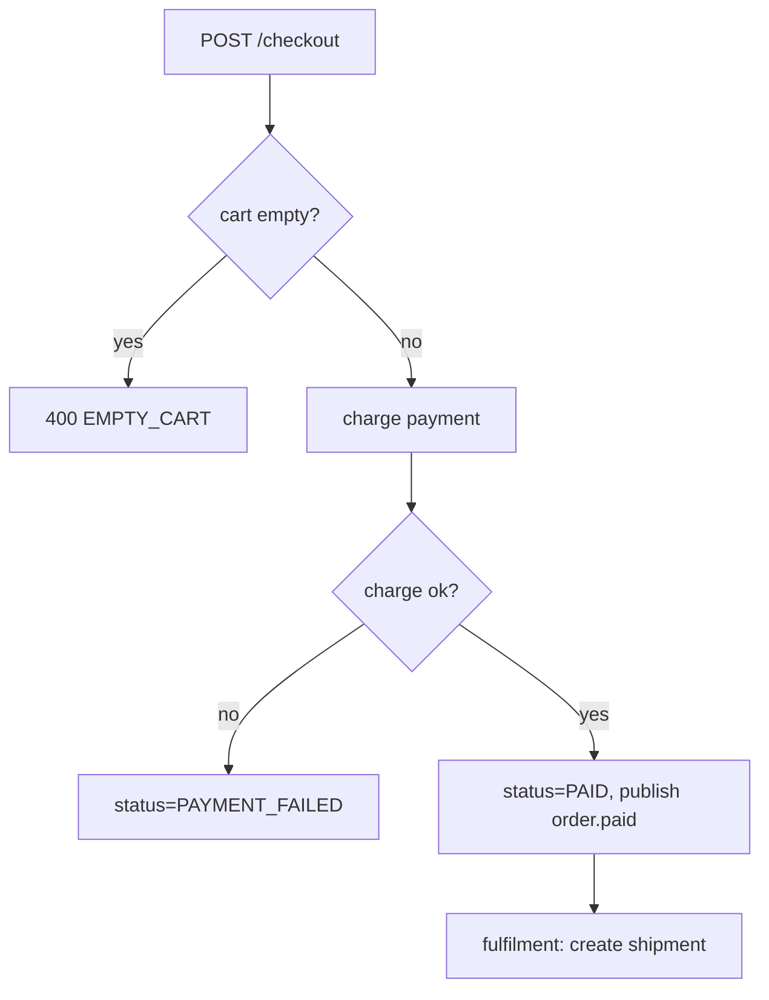

# Example fragment

A short, illustrative slice of a Flow Spec for an imaginary "Checkout → Payment → Fulfilment" flow across three services. It shows the evidence notation, the canonical pseudocode (§6), a side-effect row, and an open-questions entry. It is a *style* reference, not a real system.

---

## 5. Main flow — happy path (excerpt)
1. `order-svc` receives `POST /checkout`, validates cart not empty — `order-svc/CheckoutController.kt:L34-52` ✅
2. `order-svc` calls `payment-svc POST /charge` synchronously — `order-svc/PaymentClient.kt:L20-41` ✅
3. On success, `order-svc` sets `order.status = PAID` and publishes `order.paid` — `order-svc/CheckoutService.kt:L88-96` ✅
4. `fulfilment-svc` consumes `order.paid` and creates a shipment — `fulfilment-svc/OrderPaidHandler.kt:L15-39` ✅

## 6. Logic — pseudocode canonical (excerpt)
```pseudocode
FUNCTION checkout(req) -> Response:
  cart = cartRepo.load(req.cartId)                    // [src: CheckoutController.kt:L34]
  IF cart.items is empty [BR-001]:                     // [src: CheckoutController.kt:L40]
    RETURN Response(400, EMPTY_CART) [OUT-1]
  ELSE: (continue)
  charge = CALL payment.charge(cart.total)             // [src: PaymentClient.kt:L20]
  SWITCH charge.status [BR-002]:                       // [src: PaymentClient.kt:L33]
    CASE OK:
      order.status = PAID [STATE: *->PAID]             // [src: CheckoutService.kt:L88]
      PUBLISH "order.paid"(order.id) [SIDE-EFFECT: async] // [mq: CheckoutService.kt:L94]
    CASE 402:
      RETURN Response(402, PAYMENT_FAILED) [OUT-2]      // [src: PaymentClient.kt:L37]
    DEFAULT:
      RAISE PaymentError(charge.status) [OUT-3: error]  // [?] chưa thấy xử lý → §15
  IF amount > 10_000 [BR-003]:                          // 🟡 [src: CheckoutService.kt:L70?]
    flagForManualReview(order) [INTENT]                 // [?] chưa truy được nơi dùng → §15
  ELSE: (continue)
  RETURN Response(200, order) [OUT-4]                   // [src: CheckoutService.kt:L99]
```

### 6b. Branch registry (phái sinh)
| ID | Điều kiện | Họ nhánh | Outcome | Conf | Nguồn |
|---|---|---|---|---|---|
| BR-001 | cart rỗng | validation | OUT-1 | ✅ | `[src: CheckoutController.kt:L40]` |
| BR-002 | charge.status | error/external | OUT-2,3 | ✅ | `[src: PaymentClient.kt:L33]` |
| BR-003 | amount > 10k | business | (manual review) | 🟡 | `[src: CheckoutService.kt:L70?]` |

## 11. External integrations & side effects (excerpt)
| Tương tác | Khi nào | Target / payload | Idempotency | Retry / timeout | Khi thất bại | Conf | Nguồn |
|---|---|---|---|---|---|---|---|
| publish `order.paid` | sau khi charge OK | `{orderId, amount}` | ❓ key chưa rõ | at-least-once | event mất → shipment không tạo | ✅/❓ | `[mq: CheckoutService.kt:L94]` |

## 15. Assumptions, open questions & gaps (excerpt)
- 🟡 **BR-003 (manual review > 10k)**: thấy biến `reviewThreshold` nhưng chưa truy được nơi dùng — cơ sở: tên biến + comment. Cần xác nhận ngưỡng và đơn vị tiền.
- ❓ **Idempotency của consumer `order.paid`**: chưa thấy khử trùng lặp ở `OrderPaidHandler` → nếu event giao 2 lần có tạo 2 shipment không? Cần owner `fulfilment-svc` xác nhận.
- **Xung đột**: doc thiết kế nói retry charge 3 lần, nhưng `PaymentClient` không có retry `[src: PaymentClient.kt]` vs `[doc: payment-design.md#retry]` → coi code là chuẩn; doc có thể stale.

## 14. Diagram (excerpt)

