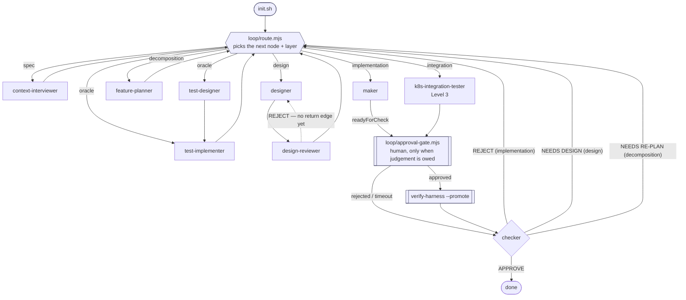

# The harness as an explicit graph

`workflow-diagram.md` draws what the harness is *meant* to do. This file states what it *actually
executes*: every node, every edge, who owns every field of shared state, and the routing rule that
picks the next node. The difference between the two documents is the point — writing this one is
what surfaced seven edges that existed only inside an agent's context.

Scope: the project loop (`loop/run-loop.sh`). The harness self-improvement loop
(`scripts/harness-loop.sh`) is a second graph; the one edge between them is listed at the end.

## Nodes

| Node | Kind | Responsibility | Reads | Writes |
|---|---|---|---|---|
| `init.mjs` | code | baseline gate — build + test + constraint gates. `init.sh`/`init.cmd` are wrappers so the same gate runs on POSIX shells and cmd.exe | repo | exit code |
| `tools/collect-services.mjs` | code | integration targets only — survey N repos into the registry; fills what is discoverable, marks the rest `needs-human` | the service repos | `services.manifest.json` |
| `tools/services-check.mjs` | code | integration targets only — the registry's own verification: exits non-zero while a deployable service lacks chart/image/health/`dependsOn` | `services.manifest.json` | exit code |
| `context-interviewer` | agent | ask only what the repo cannot answer; persist every answer | `assumptions.md`, audit output | `assumptions.md`, `cross-cutting.md`, `constraints.md`, `docs/context/**`, `DECISIONS.md` |
| `designer` | agent | components, cited claims, assumption registry, **observable seam + invariants per component**, and a `## Feature impact` table (its only way to hand scope work over — it may not write `feature_list.json`) | `requirement.md`, `docs/**` | `docs/design/**`, `architecture.md`, `assumptions.md`, `spikes/**` |
| `design-reviewer` | agent | falsify the design; verify claims by citation | `docs/design/**` | `assumptions.md`, `session-handoff.md` |
| `feature-planner` | agent | cut the design into a build/prove DAG; derive each `falsifier` from the design's invariants | `requirement.md`, design | `feature_list.json`, `goal.md`, `constraints.md` |
| `test-designer` | agent | spec → test conditions; **never reads implementation** | spec, interfaces | `tests/design/**`, `feature_list.json` (`falsifier`) |
| `test-implementer` | agent | conditions → failing test code (red first) | conditions, interfaces | test sources |
| `maker` | agent | advance exactly one feature by one step | `feature_list.digest.md`, docs | source, `feature_list.json`, `progress.md` |
| `tools/agent-context.mjs` | code | injects an agent's `resources` — Claude Code at spawn (`SubagentStart`), Codex via `codex-dispatch` calling the same script | `agents.manifest.json`, the listed files | nothing (emits context) |
| `tools/guard-write.mjs` | code | denies an edit outside an agent's `writes` (`PreToolUse`) — Claude Code per-agent, Codex project-wide keyed on `HARNESS_AGENT` | `agents.manifest.json`, the tool payload | nothing (allow/deny) |
| `tools/codex-dispatch.mjs` | code | Codex only — assembles a role (`codex exec` has no `--agent`): prompt + resources on stdin, identity in the environment | `agents.manifest.json`, prompts, `agent-context.mjs` | nothing (spawns codex) |
| `loop/route.mjs` | code | **the router** — reads shared state, returns the next node + its layer + why | `feature_list.json`, `docs/assumptions.md` | nothing (pure) |
| `loop/run-loop.sh` | code | **the dispatcher** — runs the node the router named, on kiro-cli, Claude Code or Codex (`HARNESS_RUNTIME`, else detected) | `route.mjs` output | nothing directly; the agent it spawns writes |
| `loop/approval-gate.mjs` | code | stop for a human before `done` becomes terminal; selective, timeout auto-**rejects** | `feature_list.json`, `review-digest` output | `loop/approval-request.md`, `loop/approval-log.jsonl` |
| `verify-harness --promote` | code | replay every claimed evidence; flip mechanical passes | `feature_list.json`, repo | `feature_list.json`, `trace/verify-report.json` |
| `checker` | agent | falsify the maker's claims; sole owner of `done` | `feature_list.json`, evidence | `feature_list.json`, `progress.md` (state files only) |
| `k8s-integration-tester` | agent | Level 3 proof across a real service boundary (+ the cluster lifecycle it needs) | chart, `docs/testing-standards.md`, `feature_list.json`, MCP `k8s-readonly` | chart, tests, `feature_list.json` |

`maker`, `test-implementer`, `harness-setup` and `k8s-integration-tester` write unrestricted; every
other agent is confined by its `writes` list in `agents.manifest.json` — enforced on kiro by
`toolsSettings.write.allowedPaths` and on Claude Code by the `guard-write.mjs` hook
(`runtimes.md`). **That confinement is the edge set**: an agent cannot create a handoff it has no
write access to.

Every agent node above is generated from `agents.manifest.json` into all three runtimes. Adding one
means adding a manifest entry, not writing three config files.

**The edge set is only as real as the runtime makes it.** On kiro and Claude Code the `writes` list
is enforced per agent. On Codex it is enforced only when `tools/codex-dispatch.mjs` runs the role —
Codex hooks are project-wide and its agent TOML has no hooks field, so an interactively-spawned
Codex agent has no enforced confinement and `guard-write.mjs` says so instead of implying a check
ran (`runtimes.md`). Same graph, weaker edges on one runtime; that is worth knowing before reading a
Codex session as evidence that a role stayed in its lane.

`k8s-integration-tester` is the one node whose *existence* is decided at setup. It is `optional` in
the manifest, and `gen-agents.mjs` emits an optional agent exactly when its prompt file is present —
so `setup-harness-loop.mjs --k8s on` copying `templates/k8s/**` is what puts this node in the graph.
`--k8s auto` (the default) turns it on when the target already holds a `Chart.yaml`, on the reasoning
that a repo shipping a chart is deployed to a cluster whether or not anything tests it there.

## Shared state — one owner per field

| Field | Writer | Readers | Merge rule |
|---|---|---|---|
| `feature_list.json[].status` | `checker`, `--promote` | all | single writer per feature; `blocked` beats mechanical promotion |
| `feature_list.json[].readyForCheck` | `maker` | `--promote`, `checker` | maker sets, checker clears |
| `feature_list.json[].evidence` | `maker` | `checker`, `--promote` | overwrite per attempt |
| `feature_list.json[].checkerNotes` | `checker`, `maker`, `test-designer` | `maker`, `designer`, `feature-planner` | append; **first line is the routing marker** |
| `feature_list.json[].attempts` | `maker` | gate `over-budget` | +1 per iteration, never reset |
| `feature_list.json[].falsifier` | `feature-planner`, `test-designer` | `checker` | overwrite |
| `docs/assumptions.md` | `designer`, `design-reviewer`, `context-interviewer`, `test-designer` | all | row-level; status only moves toward `verified` |
| `docs/cross-cutting.md` | `context-interviewer`, `designer` | all | a row closes only with mechanism + owner + enforcing rule |
| `progress.md` / `session-handoff.md` | `maker`, `checker` | next session | append |
| `trace/**`, `memory/<agent>/**` | each agent, its own dir only | that agent at spawn | append |
| `loop/approval.md` | **the human** | `approval-gate.mjs` | first line is the verdict; a verdict with no reason is treated as a rejection |
| `loop/approval-log.jsonl` | `approval-gate.mjs` | audit | append-only |
| `services.manifest.json` | `collect-services.mjs`, then **the human** for `health`/`dependsOn`/`image` | `services-check.mjs`, `k8s-test-env.sh --services`, `docs/services.md` | the collector never overwrites a human's answer with a guess; re-running it is a survey, not a reset |
| `docs/services.md` | `setup-harness-loop.mjs --integration` | designer, planner, k8s tester | **generated** — edit the registry and re-run, never the doc |
| `.kiro/settings/mcp.json`, `.mcp.json` **and** `.codex/config.toml` | `setup-harness-loop.mjs` | kiro / Claude Code / Codex respectively | **must stay identical in server set** — gate `mcp-runtime-skew`. One file per runtime is a format constraint, not three decisions |

## Routing rules

```
if init.sh red                            → maker (repair is its whole iteration)
if feature.checkerNotes ^ "NEEDS DESIGN:" → designer
if a design doc states no seam or
   no invariants                          → designer   [the gate, not just the marker]
if feature.checkerNotes ^ "NEEDS RE-PLAN:"→ feature-planner
if a design's Feature-impact table marks
   change/new and is newer than the
   feature list                           → feature-planner  [the design moved, the cut did not]
if an open feature has no falsifier       → test-designer
if a prove feature has a falsifier
   but no recorded test run               → test-implementer
if a build feature's prove feature
   has no test yet                        → NOT eligible (the maker would write it)
if feature.verification touches k8s       → k8s-integration-tester  [integration]
if feature.attempts >= maxAttempts        → blocked (stop retrying)
if assumption.status == needs-human       → context-interviewer   [STOPS the loop]
if feature.readyForCheck                  → verify-harness --promote → checker
if checker APPROVE                        → done
if checker REJECT                         → maker            (rollback: implementation layer)
if checker REJECT + NEEDS DESIGN          → designer         (rollback: design layer)
if checker REJECT + NEEDS RE-PLAN         → feature-planner  (rollback: decomposition layer)
if every feature done|blocked-with-reason → exit
```



Every rollback returns through `route.mjs`, which is the point: a verdict names the **layer** the
defect came from, and the router — not the checker, and not the next agent — decides who that is.

The one dotted edge is the one still unrouted: a `design-reviewer` REJECT has no return path to
the designer (implicit edge #6 below).

## The seven implicit edges

Writing the table above forced each marker to name a *destination*. Seven of them had none: they
were written to state, reported by tools, and dispatched by nobody. They worked only because a
human read a report and typed the next command.

| # | Edge | Written by | Read by | Dispatched by | Consequence |
|---|---|---|---|---|---|
| 1 | `NEEDS DESIGN:` → `designer` | maker, checker, test-designer | designer | ~~nothing~~ **`route.mjs`** | *closed* |
| 2 | `NEEDS RE-PLAN:` → `feature-planner` | checker | feature-planner | ~~nothing~~ **`route.mjs`** | *closed* |
| 3 | `needs-human` assumption → `context-interviewer` | designer, design-reviewer | context-interviewer | ~~nothing~~ **`route.mjs`** | *closed* |
| 4 | k8s feature → `k8s-integration-tester` | maker (skips it) | — | ~~nothing~~ **`route.mjs`** | *closed* |
| 5 | conditions → `test-implementer` | test-designer | test-implementer | ~~nothing~~ **`route.mjs`** | *closed 2026-08-10* — with it open, the maker wrote the test it was to be judged by |
| 6 | `design-reviewer` REJECT → `designer` | design-reviewer | designer | **nothing** | review findings die in `session-handoff.md` |
| 7 | baseline red → `maker` repair | `init.sh` | maker step 2 | **contradicted** | `run-loop.sh` exits on red *before* the repair node runs |
| 8 | chart present → `k8s-integration-tester` **exists** | the repo itself | setup | ~~nothing — a manual copy~~ **`setup-harness-loop.mjs --k8s auto`** | *closed 2026-08-13* — the node was reachable by the router and installable only by hand, so on every project that never ran that copy, rule 4 routed to an agent that did not exist |
| 9 | conditions **absent** → `test-designer` | — | test-implementer | ~~nothing — the rule keyed on the falsifier only~~ **`route.mjs`** | *closed 2026-08-13* — test-designer has two outputs (`falsifier` and `tests/design/**`) and only the first was routed on. Where the feature-planner derives falsifiers from the invariant contract, the designer rule never fires, `tests/design/` is never created, and the implementer is dispatched to implement conditions that do not exist. Measured on aeron-demo: two paid Codex sessions on `feat-sit-2`, zero output |

**Status, 2026-08-13.** Seven of the nine are closed by `loop/route.mjs`, which turned the routing
table into executable code. Two remain: #6 (`design-reviewer` REJECT has no return edge) and #7
(`run-loop.sh` exits on a red baseline *before* the maker's repair step can run). Gate
`agent-unrouted` now fails any agent that neither the router nor `route.mjs` names, so this class
cannot silently return.

### Edges 1–3 compose into a livelock, reproduced

`all_settled()` exits the loop only when every feature is `done`/`passing`, or `blocked` *with* a
recorded reason. A feature marked `NEEDS DESIGN:` is none of those — it is still `not-started`. And
`maker-prompt.md` step 3 instructs the maker to **skip** exactly those features.

```
features: feat-a NEEDS DESIGN, feat-b NEEDS RE-PLAN   → open: 2 → all_settled = 1 (not settled)
  → run-loop spawns maker → maker skips both → no state change
  → next iteration: identical → …
```

So the loop burns a paid LLM session per iteration, forever, producing nothing — and every
iteration looks healthy in the log. This is the lecture's claim landing exactly: the edges were
*documented in prose* and *reported by tooling*, and neither is the same as being modeled.

Note what did **not** find this. Nine mechanical gates, 32 demo steps and 63 assertions all pass on
this repo: every gate inspects the *content of a file*, and none inspects *which node runs next*.
The graph is a different axis of verification, not a stricter version of the same one.

## The edge between the two graphs

`verify-harness.mjs` tags every finding `layer: project` or `layer: harness`. A `harness` finding
belongs to the second graph — `harness-issue.mjs` records it, `improve-harness.mjs` ranks it,
`harness-improver` fixes the template. That edge *is* dispatched, by `harness-loop.sh`. It is the
only cross-graph edge, and the only reason a defect found while working one project can change how
every future project is scaffolded.
