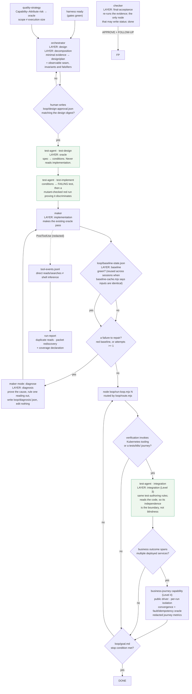
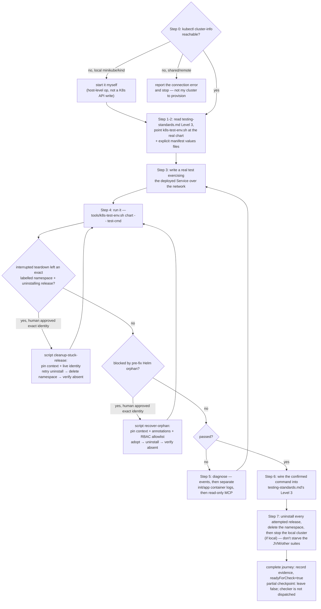

# Development workflow — from a green harness to DONE

**Scope: Floor 2.** Everything here assumes the gates in
[workflow-onboarding.md](workflow-onboarding.md) are already green. The loop that repairs the skill
itself is [workflow-improvement.md](workflow-improvement.md).

The **layer** labels are the ones `loop/route.mjs` returns. A rollback goes back to the layer the
defect came from, not one step back ([graph.md](graph.md)).

## 1. One feature, end to end



**Why the oracle sits between decomposition and implementation, and why half of it moved up into
design.** The same agent writing the code and the test can be wrong in both directions and still go
green. The defence is that the oracle's author has not read the implementation — which only holds
if the test exists *first*, so `route.mjs` refuses to make a build feature eligible until its prove
feature has a recorded red run, and that red run must be **mutant-checked**: a test that has never
been seen to fail against a deliberately wrong implementation has not been proven to discriminate.

But *case-level* test design needs a unit and an interface, which do not exist before decomposition,
while *"how would we know this works"* — the observable seam and the invariants — is a property of
the design itself. A component whose behaviour can only be seen by reaching inside it is a boundary
defect, and discovering that at test-writing time forces the choice between a bad test and a
redesign; the bad test always wins. So the orchestrator states seam + invariants and cuts the
feature plan, then the test-agent's design phase derives each `falsifier` and builds cases on top
([test-authoring.md](test-authoring.md)).

Measured symptom of the version without this: on the dogfood project **every** unfinished feature
was missing its `falsifier` — not because the planner was lazy, but because nobody upstream had
produced an invariant to derive one from.

**Why a repair detours through `diagnosis`.** A repair implemented against a guessed cause spends an
attempt, edits production code, and leaves the real cause in place. The diagnose turn is not a
repair: it proves the cause and rules one competing reading out before anything is edited
(`loop/diagnosis/README.md`).

## Agent interactions and durable handoff contracts

Agents do not choose or directly invoke one another. `loop/route.mjs` reads the durable contract
state, returns one `{node, layer, mode, why}` decision, and `run-loop.mjs` dispatches that named
agent. This prevents a handoff from surviving only in a prior agent's context.

| From → to | Router trigger | Durable contract | Receiver may rely on | Receiver must produce |
|---|---|---|---|---|
| human → orchestrator | a requirement, a human-owned gap, or a design approval is needed | human-interview receipt or `loop/design-approval.json` bound to the current design digest | the answer is explicit and evidence-backed, not inferred | bounded design/plan state; an unresolved gap returns to the human |
| orchestrator → test-agent `test-design` | open work lacks a `falsifier` or feature-linked conditions | feature contract: design digest, observable seam, invariant, `falsifier`, interfaces | implementation bodies are intentionally out of scope | `tests/design/TCON-*.json` conditions linked to the prove feature |
| test-agent `test-design` → `test-implement` | conditions exist but no discriminating test has been recorded | condition IDs plus interfaces | condition ownership is feature-specific; another feature's oracle does not qualify | red-first test source and a `mutant: true` failing run |
| test-agent → maker | a build feature's prove dependency has a mutant-checked red run | eligible feature contract: verification, falsifier, dependencies, fresh context packet | the oracle precedes implementation | one bounded code step or a complete handoff; never `status: done` |
| maker → checker | every non-blocked open feature has `readyForCheck: true` and passes `review-contract.mjs --ready` | digest-bound `reviewPacket`, evidence, verification result, `readyForCheck: true` | the claim is complete enough to falsify; `passing` remains open | typed APPROVE/REJECT verdict; only checker writes `status: done` |
| checker → orchestrator / maker | `NEEDS DESIGN:`, `NEEDS RE-PLAN:`, or ordinary REJECT | `checkerNotes` first-line marker plus structured verdict/counterexample | marker identity is stable across appended diagnostics | router selects design/planning or implementation; no agent self-routes |
| verifier → harness-manager | finding classified `layer: harness` | issue signature, affected target, detector evidence | repair belongs in canonical source, never only the target | source repair, `demo.sh` evidence, upgrade context and re-verification |

The detailed visual counterpart is [agent-interaction-contracts.svg](diagram/agent-interaction-contracts.svg).

## 2. Inside one iteration — generator/evaluator separation (Lesson 9/13)

The maker never grades itself; only the checker (re-running evidence independently) may set
`status: done`. The separation is also temporal: makers finish and hand off the whole delivery
before the checker runs one final acceptance batch. See
[loop-engineering.md](loop-engineering.md)'s "Generator/evaluator separation" section for why.

One iteration may be several makers at once, over disjoint file sets inside one feature — but never
several *features*, and never a parallel test run. [graph.md](graph.md) states the fan-out and
fan-in rules; the short version is that the verification is what makes a claim, and a claim is made
once, by one agent.

```mermaid
sequenceDiagram
    participant RL as run-loop.mjs
    participant M as maker agent
    participant FS as feature_list.json (disk)
    participant C as checker agent

    RL->>RL: all features done/blocked-with-reason/<br/>passing without readyForCheck?<br/>→ exit early, no LLM session spawned
    RL->>RL: baseline gate — reuse a green one when<br/>loop/baseline-cache.mjs says the inputs are identical
    RL->>M: dispatch (retry only when nothing came back)<br/>ACP initialize → session/new → session/prompt
    M->>FS: pick first not-started feature<br/>whose dependencies are done or handed off<br/>(skip NEEDS RE-PLAN and k8s-specialized ones)
    alt the step has 2+ independent file sets
        M->>FS: write loop/work-split/<feat>.json, then stop
        RL->>FS: tools/work-split.mjs validate —<br/>slices disjoint? briefs self-contained?<br/>fan-in runs the feature verification?
        RL->>M: mode slice-fanout: one maker per slice,<br/>each confined to its paths by guard-write.mjs
        RL->>M: mode integrate: ONE maker runs the tests<br/>(the verification never fans out)
    else one file set
        M->>M: implement one bounded step, run the<br/>most relevant verification for real
    end
    alt feature-level behavior is incomplete
        M->>FS: checkpoint evidence/progress,<br/>readyForCheck=false
        RL->>RL: next iteration routes the<br/>active feature to maker
    else complete behavior + green verification + complete evidence
        M->>FS: reviewPacket + readyForCheck=true<br/>(cannot write status=done; passing remains open)
        RL->>RL: continue delivery while any<br/>non-blocked open feature is not handed off
        alt every remaining feature handed off
        RL->>FS: review-contract.mjs --ready<br/>admits the complete final batch
        RL->>C: one final ACP session/prompt<br/>(kiro-cli acp --agent checker)
        C->>FS: review every readyForCheck feature<br/>as one integrated delivery
        C->>C: semantic review — behavior actually met,<br/>no scope bleed; falsify, don't confirm
        alt claim survives
            C->>FS: status=done
        else evidence fails or scope drifted
            C->>FS: attempts += 1; status=in-progress<br/>+ checkerNotes (or blocked at maxAttempts)
        else feature itself is mis-cut
            C->>FS: checkerNotes = "NEEDS RE-PLAN: ..."<br/>→ routes to orchestrator, not the maker
        end
        end
    end
    RL->>FS: record baseline-state.json<br/>with outcome + evidence digest
    alt baseline red and its cause is not on record
        RL->>M: mode diagnose — prove the cause, edit nothing
    else cause on record, first repair
        RL->>M: bounded baseline repair turn
    else same red digest after repair
        RL->>H: stop — needs human
    end
```

## 3. `test-agent` integration phase (opt-in, `templates/k8s/`)

A specialized `test-agent` phase for K8s Level-3 features — same "cannot set status=done" rule as
the maker in diagram 2, plus one extra boundary: it diagnoses, `tools/k8s-test-env.sh` is the only thing that
ever deploys or tears down. See [k8s-integration-testing.md](k8s-integration-testing.md) for the
full reasoning, including the resource-contention and kubeconfig-wipe gotchas this diagram's
Step 0/7 exist for.


