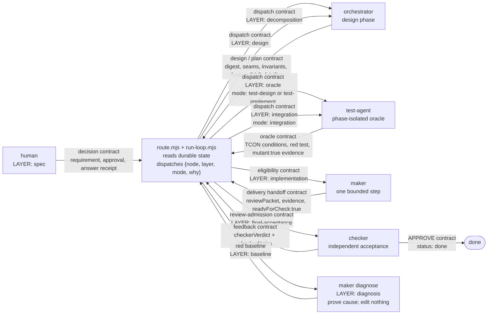

# Development workflow — one routed delivery contract at a time

**Scope: Floor 2.** A green harness dispatches one phase selected by `loop/route.mjs`; no agent
chooses its successor. The visual companion is
[agent-interaction-contracts.svg](diagram/agent-interaction-contracts.svg).

## Handoff contracts

| From → to | Contract on the routed edge | Required output |
|---|---|---|
| human → orchestrator | decision receipt or digest-bound design approval | bounded design or a recorded human question |
| orchestrator → test-agent | design/plan: observable seam, invariant, falsifier, interfaces | feature-linked `TCON-*.json` conditions |
| test-agent → maker | oracle: red-first test and `mutant: true` evidence | an implementation-eligible feature contract |
| maker → checker | delivery: digest-bound `reviewPacket`, evidence, `readyForCheck: true` | one integrated claim ready to falsify |
| checker → router | feedback: typed verdict and first-line `checkerNotes` marker | router-selected repair, re-plan, or design phase |

`passing` remains open while `readyForCheck: true`; only checker may set `status: done`. Kubernetes
work is the `test-agent` integration mode and deploys only through `tools/k8s-test-env.sh`. A red
baseline first routes a maker to diagnosis, so a repair is never made against a guessed cause.

The detailed contract graph and the compact five-agent overview remain available as
[agent-interaction-contracts.svg](diagram/agent-interaction-contracts.svg) and
[five-agent-workflow.svg](diagram/five-agent-workflow.svg).
