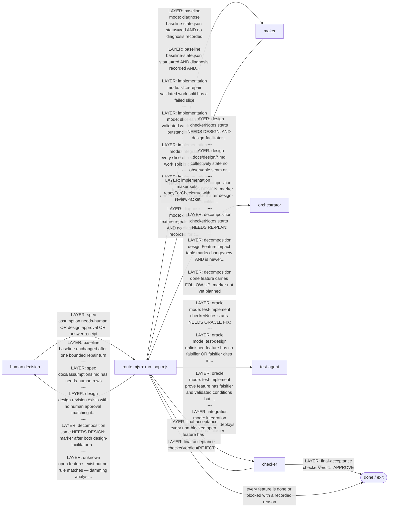

# Development workflow — one routed delivery contract at a time

<!-- GENERATED from workflow-model.json by scripts/generate-workflows.mjs. Do not hand-edit. -->

**Scope: Floor 2.** A green harness dispatches one phase selected by `loop/route.mjs`; no agent
chooses its successor. The visual companion is
[agent-interaction-contracts.svg](diagram/agent-interaction-contracts.svg).

## Handoff contracts

| Edge | From → To | Layer | Contract fields | Writer | Consumer |
|---|---|---|---|---|---|
| human-decision | human → router | spec | decision, approvedBy, designDigest | human | route.mjs |
| baseline-red-diagnose | router → maker | baseline | evidenceDigest, status | loop/baseline-cache.mjs | route.mjs |
| baseline-red-repair | router → maker | baseline | evidenceDigest, diagnosis | maker | route.mjs |
| needs-human-assumption | router → human | spec | assumption rows | any agent | route.mjs |
| needs-design-first | router → orchestrator | design | checkerNotes, markerHash | checker | route.mjs → orchestrator → design-facilitator |
| design-untestable | router → orchestrator | design | design files content | design-facilitator | route.mjs |
| design-approval-needed | router → human | design | designDigest, status, approvedBy | human | route.mjs |
| needs-design-planner | router → orchestrator | decomposition | checkerNotes, markerHash, route-log dispatch history | orchestrator → feature-planner | route.mjs |
| needs-replan | router → orchestrator | decomposition | checkerNotes, markerHash | checker | route.mjs → orchestrator → feature-planner |
| design-impact-recut | router → orchestrator | decomposition | Feature impact table rows, feature_list.json mtime | design-facilitator | route.mjs → orchestrator → feature-planner |
| needs-oracle-fix | router → test-agent | oracle | checkerNotes, markerHash | checker | route.mjs |
| oracle-falsifier-missing | router → test-agent | oracle | falsifier, conditions (TCON-*.json), conditionCitations | test-agent (test-designer mode) | route.mjs |
| oracle-test-unwritten | router → test-agent | oracle | falsifier, conditions, evidence, mutant:true | test-agent (test-implementer mode) | route.mjs |
| final-acceptance | router → checker | final-acceptance | readyForCheck, reviewPacket, evidence | maker | checker |
| k8s-integration | router → test-agent | integration | verification command, k8s-test-env | test-agent (integration mode) | route.mjs |
| slice-repair | router → maker | implementation | work-split plan, failed slice status | maker (slice worker) | route.mjs |
| slice-fanout | router → maker | implementation | work-split plan, slice briefs, HARNESS_FEATURE, HARNESS_SLICE | maker (plan author) | orchestrator → parallel makers |
| slice-integrate | router → maker | implementation | work-split plan, all slices complete | maker (slice workers) | one maker (integrator) |
| maker-eligible | router → maker | implementation | dependencies, attempts, maxAttempts, readyForCheck | maker | route.mjs |
| maker-diagnose | router → maker | diagnosis | attempts, diagnosis (symptom, cause, provedBy, ruledOut) | maker | route.mjs |
| checker-approve | checker → exit | final-acceptance | status:done, checkerNotes | checker | feature_list.json |
| checker-reject | checker → router | final-acceptance | checkerVerdict, checkerNotes, attempts | checker | route.mjs |
| maker-handoff | maker → router | implementation | reviewPacket, contractDigest, evidence, readyForCheck | maker | route.mjs → checker |
| follow-up | router → orchestrator | decomposition | checkerNotes FOLLOW-UP:, requestId | checker | route.mjs → orchestrator → feature-planner |

## Layers — precedence order

| Layer | Depth | Description |
|---|---|---|
| spec | 1 | Requirements and assumptions awaiting human confirmation |
| baseline | 2 | A failing verification gate that must be fixed before feature work |
| design | 3 | A missing design seam or invariant |
| decomposition | 4 | Incorrect feature slicing or missing post-design updates |
| oracle | 5 | Falsifier, test conditions, and oracle tests |
| integration | 6 | Deployment and testing on a real cluster |
| implementation | 7 | Feature implementation — only after every higher layer is clear |
| diagnosis | 7 | Diagnose the cause before fixing it (same layer as implementation) |
| final-acceptance | 8 | Final checker approval — only the checker sets done |
| unknown | 0 | The router cannot identify a layer — every rule declines while open work remains |

Deeper layers (lower depth) have higher routing priority.
The router checks spec → baseline → design → ... → implementation.

`passing` remains open while `readyForCheck: true`; only checker may set `status: done`. Kubernetes
work is the `test-agent` integration mode and deploys only through `tools/k8s-test-env.sh`. A red
baseline first routes a maker to diagnosis, so a repair is never made against a guessed cause.

The detailed contract graph and the compact five-agent overview remain available as
[agent-interaction-contracts.svg](diagram/agent-interaction-contracts.svg) and
[five-agent-workflow.svg](diagram/five-agent-workflow.svg).
