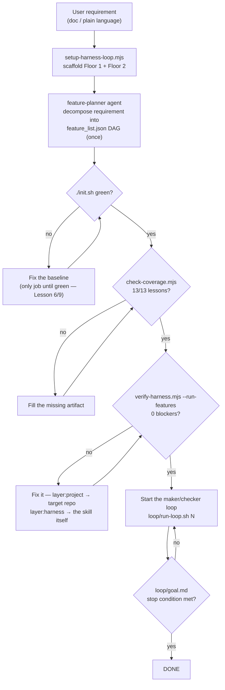
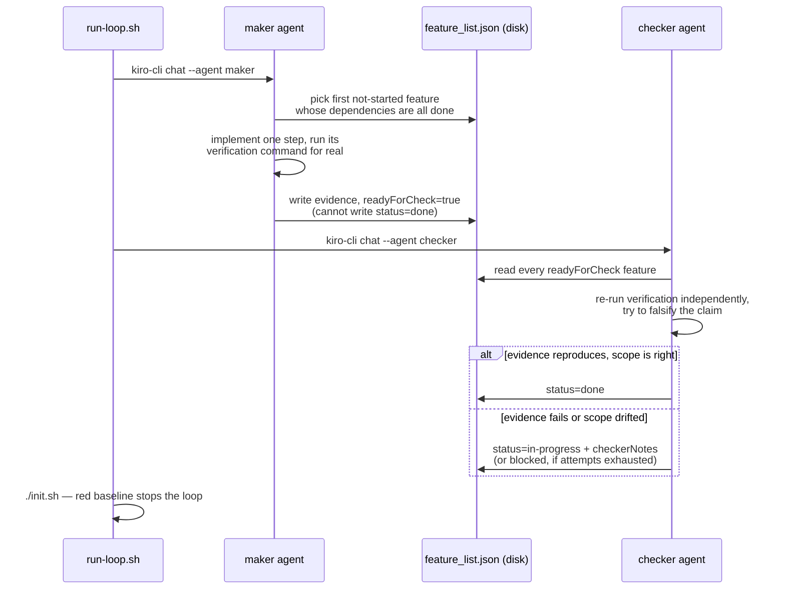
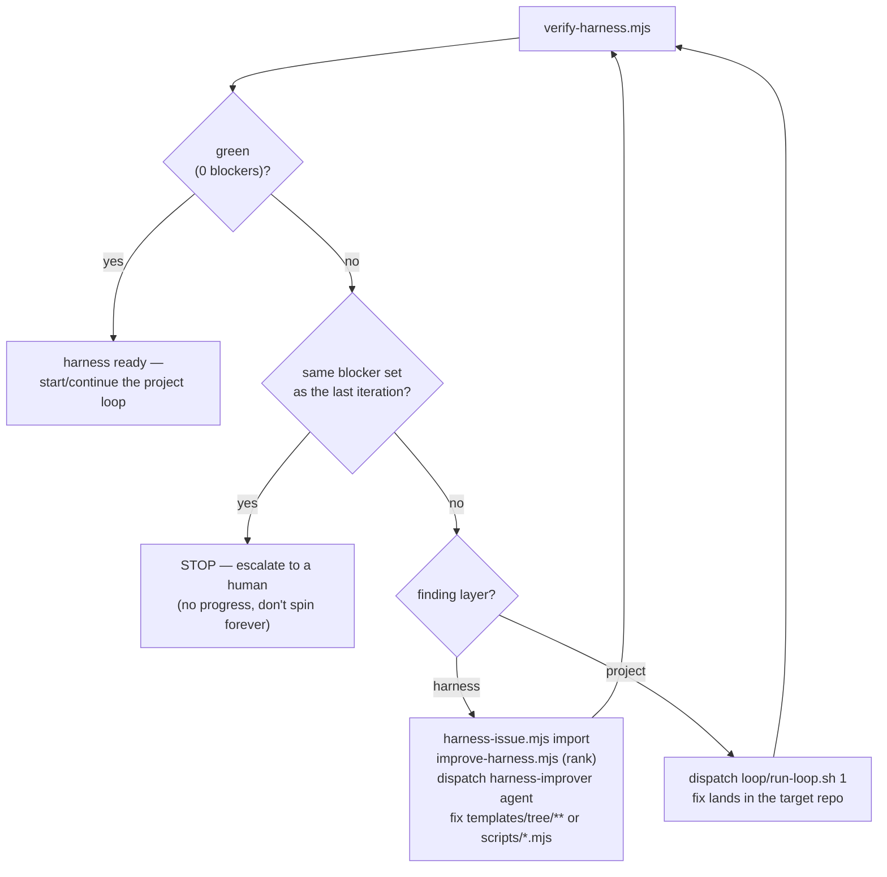

# Workflow diagrams

Visual companions to the "Lifecycle: create → verify → improve" and "Setup workflow" sections of
`SKILL.md`. Nothing here is new information — each diagram is a picture of a process already
described in prose elsewhere in this skill; read the linked section for the reasoning, use the
diagram to get oriented fast or to hand to someone who hasn't read the prose yet.

## 1. End-to-end: requirement → DONE

One pass through Floor 1 (harness) then Floor 2 (loop), matching `SKILL.md`'s Setup workflow
steps 1:1.

## 2. Inside one loop iteration — generator/evaluator separation (Lesson 9/13)

The maker never grades itself; only the checker (re-running evidence independently) may set
`status: done`. See `references/loop-engineering.md`'s "Generator/evaluator separation" section
for why.

## 3. The self-improvement loop (`harness-loop.sh`) — fixes the skill, not just the target

Runs alongside the project loop; every finding is routed by `layer`, and closing an issue
requires a real re-verify, never a claim. See `references/harness-improvement-loop.md` for the
full layer-classification contract this diagram implements.

