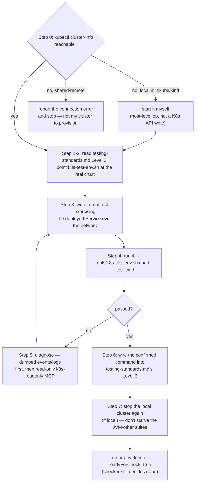
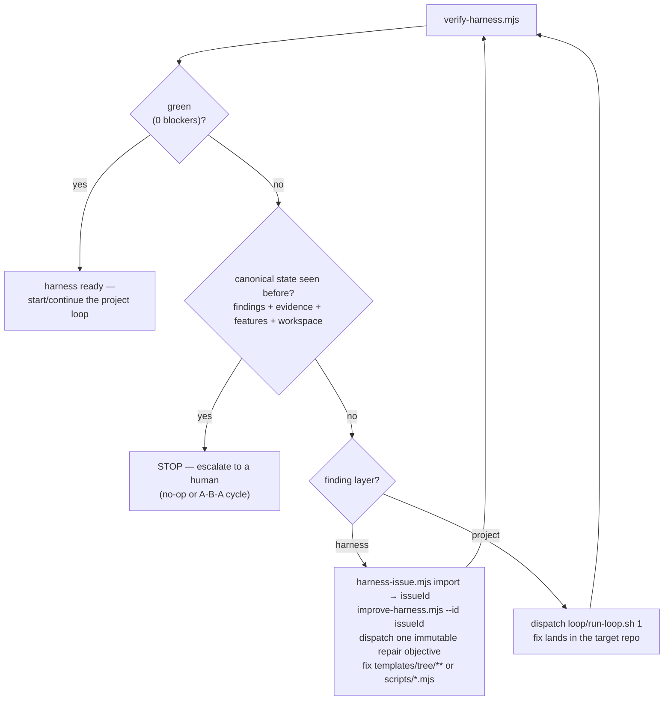

# Workflow diagrams

Visual companions to the "Lifecycle: create → verify → improve" and "Setup workflow" sections of
`SKILL.md`. Nothing here is new information — each diagram is a picture of a process already
described in prose elsewhere in this skill; read the linked section for the reasoning, use the
diagram to get oriented fast or to hand to someone who hasn't read the prose yet.

## 1. End-to-end: requirement → DONE

One pass through Floor 1 (harness) then Floor 2 (loop), matching `SKILL.md`'s Setup workflow.
The **layer** labels are the ones `loop/route.mjs` returns — a rollback goes back to the layer the
defect came from, not one step back (`graph.md`).

```mermaid
flowchart TD
    HP["user-scope human-presenter\nreader task · provenance · uncertainty\nsmallest useful representation"] -. "audits substantive human-facing output\nwithout becoming a workflow node" .-> A
    A["User requirement"] --> ADOPT{"Existing repo\nwith history?"}
    ADOPT -- yes --> EH{"existing harness\nmachinery?"}
    EH -- no --> ON["harness-onboarder\nsurvey → ask → scaffold →\nadoption-baseline --record"]
    EH -- yes --> HU["harness-upgrade skill\ndry-run → ownership plan → human merge\n→ regenerate → verify"]
    HU --> HI
    ADOPT -- no --> B["setup-harness-loop.mjs"]
    ON --> HI
    B --> HI["current agent + human-interview\nLAYER: spec\nfind evidence → ask → receipt\nno context switch"]
    IIR["init-integration-project\ncheap inventory → evidence-rich\ntyped questions"] --> HR{"human answers complete\nand digest-current?"}
    HR -- no --> IIR
    HR -- yes --> IIF["finalize-integration-init\nvalidate → registry + environment\n+ journey oracle + risk portfolio"]
    IIF --> B
    B --> CP
    CS["collect-services\nwide inventory + rule provenance"] --> CP["context-plan\nactive feature touches → scoped rules"]
    CP --> AC["agent-context\nload scoped rules + fresh feature packet\n+ mustRead originals + receipt"]
    AC -. scoped context at dispatch .-> DS
    AC -. scoped context at dispatch .-> MK
    MK -. "PostToolUse (redacted)" .-> TEL["tool-events.jsonl\ndirect reads/searches ≠ shell inference"]
    TEL --> RR["run-report\nduplicate reads · packet rediscovery\n+ coverage declaration"]
    HI --> DS["designer → design-reviewer\nLAYER: design\ncomponents · cited claims · live assumptions\n(HTML examples excluded)\n+ observable seam & invariants per component"]
    DS --> FP["feature-planner + capability skill\nLAYER: decomposition\ndraft → check-plan.mjs → publish\nbuild/prove DAG + digest-bound context packet"]
    IIF --> QS["quality-strategy\nCapability–Attribute risk → oracle\nscope ≠ execution size"]
    QS --> FP
    FP --> TD["test-designer\nLAYER: oracle\nspec → conditions. Never reads the code."]
    TD --> TI["test-implementer\nconditions → FAILING test\nred observed and recorded"]
    TI --> MK["maker\nLAYER: implementation\nmakes the existing oracle pass"]
    MK --> GATES{"init.sh green ·\ncheck-coverage 13/13 ·\nverify-harness 0 blockers"}
    GATES -- no --> FIX["layer:project → fix the target\nlayer:harness → fix the SKILL"]
    FIX --> GATES
    GATES -- yes --> LOOP["loop/run-loop.sh N\nrouted by loop/route.mjs"]
    LOOP --> K8S{"verification crosses a real\nservice boundary?"}
    K8S -- yes --> KT["k8s-integration-tester\nLAYER: integration (Level 3)\nsame test-authoring rules;\nreads the code, so its independence\nis the boundary, not blindness"]
    KT --> BJ{"business outcome spans\nmultiple deployed services?"}
    BJ -- yes --> BJC["business-journey capability (Level 4)\npublic driver · per-run isolation\nconvergence + fault/idempotency oracle\nredacted journey metrics"]
    BJC --> STOP
    BJ -- no --> STOP
    K8S -- no --> STOP{"loop/goal.md\nstop condition met?"}
    STOP -- no --> LOOP
    STOP -- yes --> I["DONE"]
    classDef oracle fill:#eef7ee,stroke:#4a7
    class TD,TI,KT oracle
```



**Why the oracle sits between decomposition and implementation, and why half of it moved up into
design.** The same agent writing the code and the test can be wrong in both directions and still go
green. The defence is that the oracle's author has not read the implementation — which only holds
if the test exists *first*, so `route.mjs` refuses to make a build feature eligible until its prove
feature has a recorded red run.

But *case-level* test design needs a unit and an interface, which do not exist before decomposition,
while *"how would we know this works"* — the observable seam and the invariants — is a property of
the design itself. A component whose behaviour can only be seen by reaching inside it is a boundary
defect, and discovering that at test-writing time forces the choice between a bad test and a
redesign; the bad test always wins. So the designer states seam + invariants, the planner derives
each `falsifier` from them, and the test-designer builds cases on top
([test-authoring.md](test-authoring.md)).

Measured symptom of the version without this: on the dogfood project **every** unfinished feature
was missing its `falsifier` — not because the planner was lazy, but because nobody upstream had
produced an invariant to derive one from.

## 2. Inside one loop iteration — generator/evaluator separation (Lesson 9/13)

The maker never grades itself; only the checker (re-running evidence independently) may set
`status: done`. See `references/loop-engineering.md`'s "Generator/evaluator separation" section
for why.

```mermaid
sequenceDiagram
    participant RL as run-loop.sh
    participant M as maker agent
    participant FS as feature_list.json (disk)
    participant C as checker agent

    RL->>RL: all features done/blocked-with-reason?<br/>→ exit early, no LLM session spawned
    RL->>M: kiro-cli chat --agent maker
    M->>FS: pick first not-started feature<br/>whose dependencies are all done<br/>(skip NEEDS RE-PLAN and k8s-specialized ones)
    M->>M: implement one step, run its<br/>verification command for real
    M->>FS: write evidence, readyForCheck=true<br/>(cannot write status=done)
    RL->>FS: tools/verify-harness.mjs --promote —<br/>mechanical replay; flip clean reproductions<br/>to done (never touches blocked)
    RL->>C: kiro-cli chat --agent checker
    C->>FS: read remaining readyForCheck features<br/>+ spot-check the promoted ones
    C->>C: semantic review — behavior actually met,<br/>no scope bleed; falsify, don't confirm
    alt claim survives
        C->>FS: status=done
    else evidence fails or scope drifted
        C->>FS: status=in-progress + checkerNotes<br/>(or blocked, if attempts exhausted)
    else feature itself is mis-cut
        C->>FS: checkerNotes = "NEEDS RE-PLAN: ..."<br/>→ routes to feature-planner, not the maker
    end
    RL->>FS: record baseline-state.json<br/>with outcome + evidence digest
    alt baseline red and new
        RL->>M: bounded baseline repair turn
    else same red digest after repair
        RL->>H: stop — needs human
    end
```

## 3. `k8s-integration-tester`'s own workflow (opt-in, `templates/k8s/`)

A specialized maker for K8s Level-3 features — same "cannot set status=done" rule as the maker in
diagram 2, plus one extra boundary: it diagnoses, `tools/k8s-test-env.sh` is the only thing that
ever deploys or tears down. See `references/k8s-integration-testing.md` for the full reasoning,
including the resource-contention and kubeconfig-wipe gotchas this diagram's Step 0/7 exist for.



## 4. The self-improvement loop (`harness-loop.sh`) — fixes the skill, not just the target

Runs alongside the project loop; every finding is routed by `layer`, and closing an issue
requires a real re-verify, never a claim. See `references/harness-improvement-loop.md` for the
full layer-classification contract this diagram implements.


