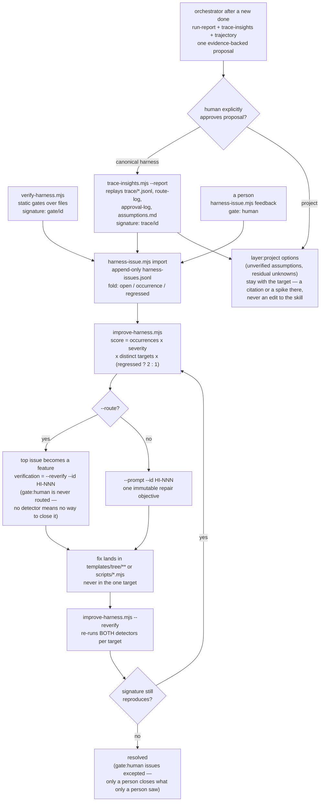
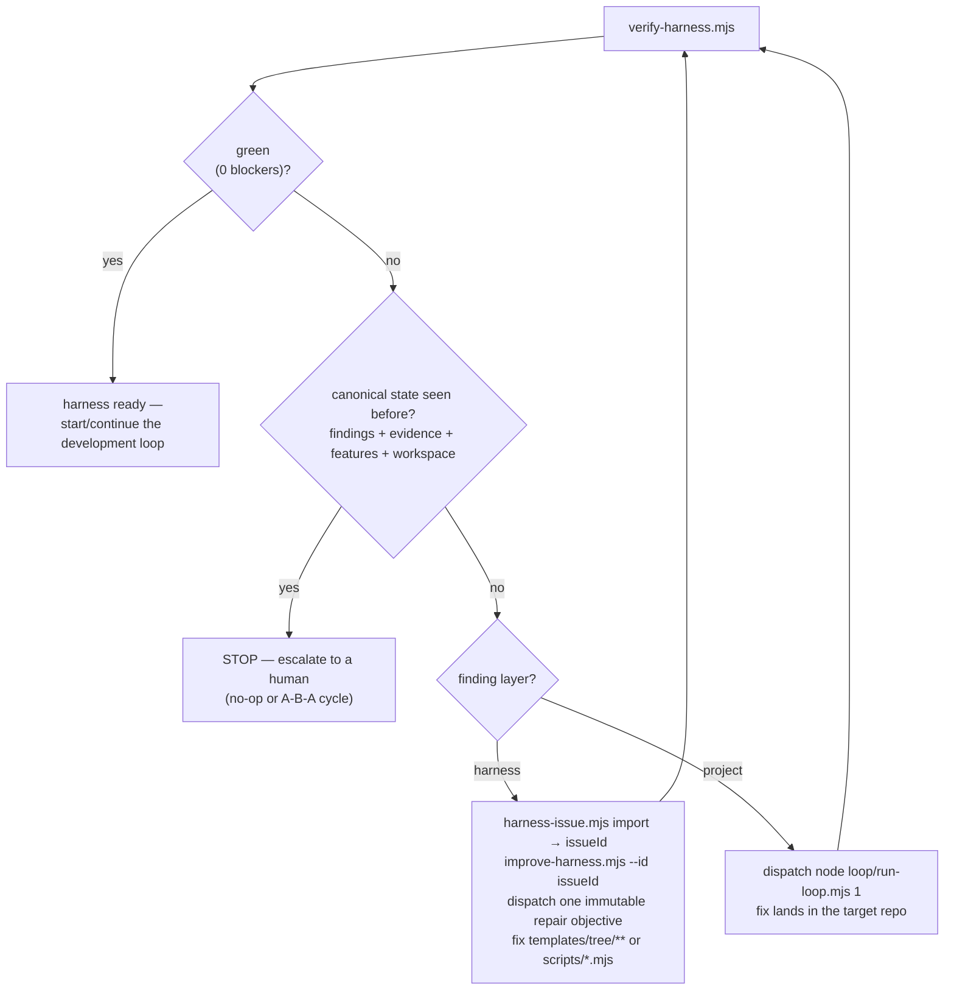

# Improvement workflow — the loop that fixes the skill, not the target

Runs alongside the development loop. Every finding is routed by `layer`, and closing an issue
requires a real re-verify, never a claim. See
[harness-improvement-loop.md](harness-improvement-loop.md) for the full layer-classification
contract this diagram implements.

## Three producers, one backlog

The backlog began with one producer — the static gates, which inspect files. Two more signals
existed and evaporated at the end of every session: what the loop actually *did*, and what it made
a *person* do. Human attention is the one input this harness cannot renew
([human-attention.md](human-attention.md)).

## The rule that makes it honest

**Nothing can type "fixed" and have it stick.** The only route to `resolved` is `--reverify`
actually re-running the detectors against a real target and finding the signature gone. That is the
same generator/evaluator separation the maker–checker loop already requires, applied to the
skill's own defects.

Two consequences worth stating outright:

- **Re-verification runs every detector.** Running only the static gates would make every
  trace-sourced issue look fixed the moment it was imported — absence from a detector that never
  emits it is not evidence of anything.
- **A `gate: human` issue never auto-resolves and is never auto-routed.** It has no detector to
  fall silent, so silence retiring it would mean the loop closes the complaint by being unable to
  see it; and a routed feature with no way to verify itself is a livelock, eligible forever.
- **Telemetry does not authorize an edit.** The orchestrator proposes one evidence-backed change
  after a newly completed feature; only an explicit human approval sends it to this graph or to the
  project's feature planner.

## The meta-loop's stop condition

It keeps **every** fingerprint seen during the run, not just the previous one: comparing only
consecutive states misses an A→B→A cycle, and stops falsely when the same gate is producing changed
evidence.
