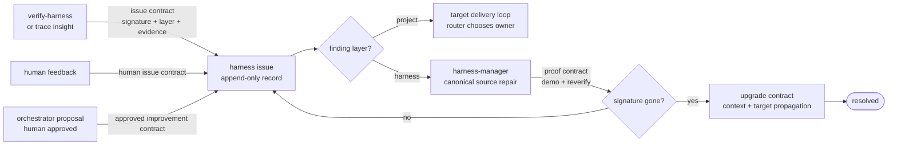

# Improvement workflow — repair the harness, not one target

<!-- GENERATED from workflow-model.json by scripts/generate-workflows.mjs. Do not hand-edit. -->

Every repair starts with a reproducible finding and ends only after the detector no longer emits
that finding. Delivery work remains in [workflow-development.md](workflow-development.md).

`harness-manager` edits `templates/tree/**` or `scripts/**`, never only the target that exposed
the bug. A human-owned issue does not auto-resolve: no detector can prove a person's observation
has disappeared.
