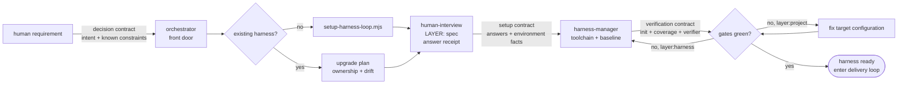

# Onboarding workflow — requirement to a green harness

**Scope: Floor 1.** Do not start delivery until the harness is observable, verifiable, and green.
The development and self-repair maps are [workflow-development.md](workflow-development.md) and
[workflow-improvement.md](workflow-improvement.md).

The human provides only decisions that tools cannot discover. `harness-manager` turns those answers
into a real baseline and verification commands; a target defect stays in the target, while a
`layer:harness` finding returns to canonical source repair.

For integration projects, collect the service inventory before setup. Unknown health, dependency,
or environment facts remain human-owned answers rather than guessed defaults.
