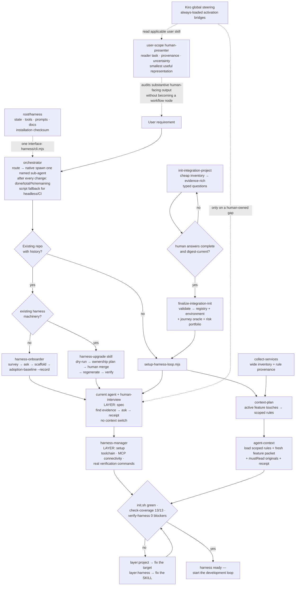

# Onboarding workflow — from a requirement to a green harness

**Scope: Floor 1.** Everything here happens *before* the loop runs a single iteration. It ends at
one condition: the gates are green, so a loop started now is amplifying a working harness instead
of a broken one (`SKILL.md`, Setup workflow; Lesson 6/9).

The development loop is [workflow-development.md](workflow-development.md). The loop that repairs
the skill itself is [workflow-improvement.md](workflow-improvement.md).

Nothing here is new information — every box is a process described in prose elsewhere in this
skill. Read the linked section for the reasoning; use the diagram to get oriented, or to hand to
someone who has not read the prose yet.

## The path in

Two entry conditions, not one. A repo that already has code and history cannot be scaffolded over —
its back catalogue would arrive as a wall of day-one warnings, and a warning nobody can act on is
a warning everyone learns to ignore ([adopting-an-existing-project.md](adopting-an-existing-project.md)).

## Why the multi-service branch is a separate entry

`init-integration-project` and `finalize-integration-init` sit before the scaffold rather than
inside it because their output is *human answers*, not inferences. The questions carry source
evidence, an owner, an answer contract and the impact of leaving them blank; `finalize` refuses to
proceed on placeholders rather than manufacture a plausible system
([multi-service.md](multi-service.md)). A guessed service boundary is the most expensive kind of
wrong to discover later, because everything downstream is cut around it.

## Why adoption records a baseline instead of failing

`adoption-baseline --record` freezes the pre-existing warning counts as **accepted debt**. After
that, only what gets *worse* is reported, and `--ratchet` lowers the baseline as debt is paid so it
cannot creep back. Blockers and a red `init.sh` are never grandfathered — the point is to make the
back catalogue silent, not to make it invisible.

## Where onboarding stops

At `READY`. The gates are the seam: a green `init.sh`, thirteen structural lessons covered, and no
blocker in `verify-harness`. Starting the loop before that point is Lesson 9's failure mode — the
loop faithfully amplifies whatever it was pointed at.
